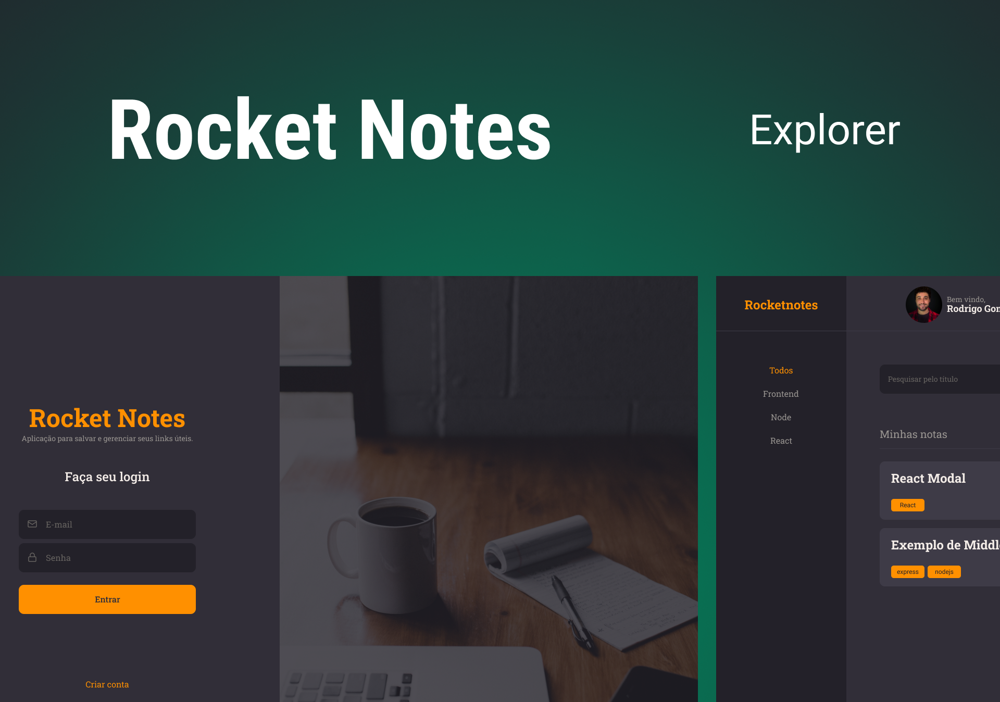
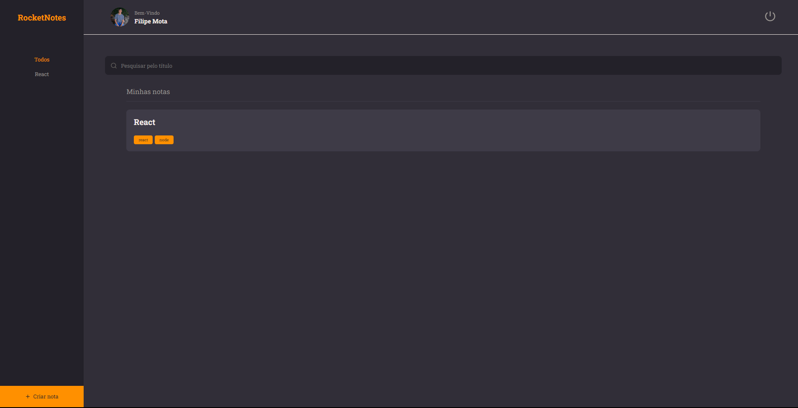
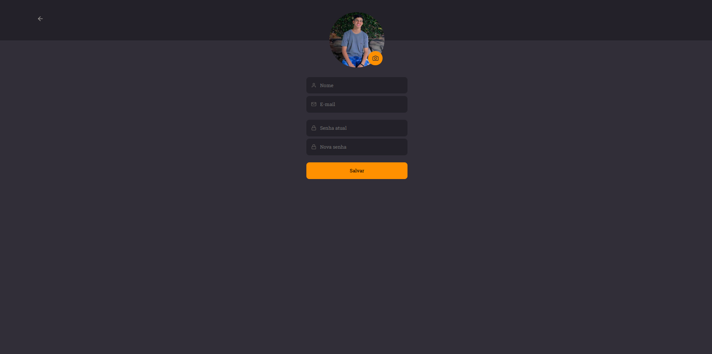
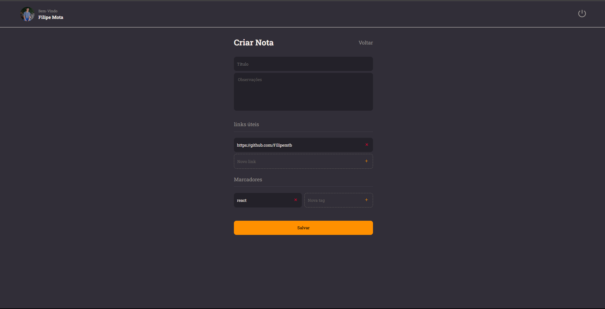

<h1 align="center">
    📝 Rocketnotes Web
</h1>

<p align="center">
    
  </a>
</p>

<h4 align="center"> 
	🚀 Aplicação Front-End Finalizada 🚀
</h4>

<p align="center">
 <a href="#-about">About</a> |
 <a href="#-layout">Layout</a> | 
 <a href="#-how-it-works">Como funciona</a> | 
 <a href="#-technologies">Technologies</a> | 
 <a href="#-license">License</a>
</p>


## 💻 About

O Rocketnotes é uma aplicação web na qual os usuários podem se cadastrar e criar de forma organizada anotações sobre determinados assuntos, tendo disponível a adição de titulo, descrição, links e tags para cada nota, além de contar a edição de perfil do usuário, podendo alterar seu avatar, nome, email e senha.

---

<!-- ## ⚙️ Funcionalidades

- [x] Empresas ou entidades podem se cadastrar na plataforma web enviando:
  - [x] uma imagem do ponto de coleta
  - [x] nome da entidade, email e whatsapp
  - [x] e o endereço para que ele possa aparecer no mapa
  - [x] além de selecionar um ou mais ítens de coleta: 
    - lâmpadas
    - pilhas e baterias
    - papéis e papelão
    - resíduos eletrônicos
    - resíduos orgânicos
    - óleo de cozinha

- [x] Os usuários tem acesso ao aplicativo móvel, onde podem:
  - [x] navegar pelo mapa para ver as instituições cadastradas
  - [x] entrar em contato com a entidade através do E-mail ou do WhatsApp

--- -->

## Web

#### SignUp


<p align="center">
  
</p>

#### SignIn
<p align="center">
  
</p>

#### Home
<p align="center">
  
</p>

#### Perfil
<p align="center">
  
</p>

#### Note Create
<p align="center">
  
</p>

---

## 🔗 Deploy

Para acessar o deploy do Website da aplicação basta clicar no link a seguir: [Link](https://rocketnotesweb.netlify.app/)

> Obs: a aplicação pode demorar um pouco para entrar na primeira execução depois de um tempo, devido ao back-end estar rodando através do plano gratuito na plataforma de hospedagem.

---

## 🚀 Como Funciona:

Este projeto contem parte Front-end e Back-end, mas neste repositório só está a parte Front-end Web.

### Pré-requisitos

Antes de baixar o projeto você vai precisar ter instalado na sua máquina as seguintes ferramentas:

* [Git](https://git-scm.com)
* [NodeJS](https://nodejs.org/en/)
* [Yarn](https://yarnpkg.com/) ou [NPM](https://www.npmjs.com/)

Além disto é bom ter um editor para trabalhar com o código como [VSCode](https://code.visualstudio.com/)

#### 🧭 Rodando a aplicação web (Frontend)

```bash
# Clone este repositório
$ git@github.com:Filipemtb/FrontEnd-RocketMovies.git

# Vá para a pasta da aplicação Front End
$ cd FrontEnd-RocketMovies

# Instale as dependências
$ npm install

# Execute a aplicação em modo de desenvolvimento
$ npm run dev

# A aplicação será aberta em uma porta especificada no terminal de execução
```

---

## 🛠 Technologies

As seguintes ferramentas foram usadas na construção do projeto:

#### **Website**  ([Vite](https://vitejs.dev/)  +  [TypeScript](https://www.typescriptlang.org/))

-   **[Styled-Components](https://styled-components.com/)**
-   **[React-Icons](https://react-icons.github.io/react-icons/)**
-   **[React-Router-DOM](https://reactrouter.com/en/main/start/tutorial)**

---
Você pode visualizar o layout do projeto através [DESSE LINK](https://www.figma.com/file/hbBzycZDR4WGSVWyK5aOqV?node-id=0-1&t=qfiqEWj0F2ORiCtg-0). É necessário ter conta no [Figma](https://figma.com) para acessá-lo.

---
